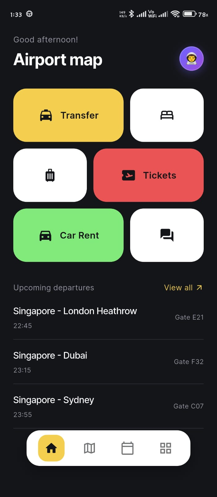
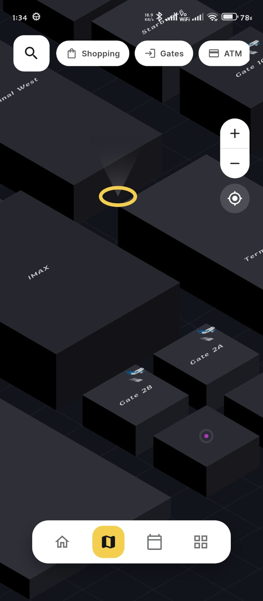
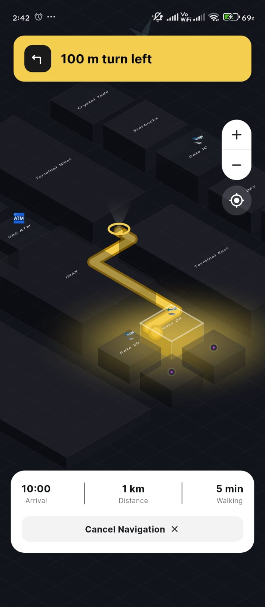
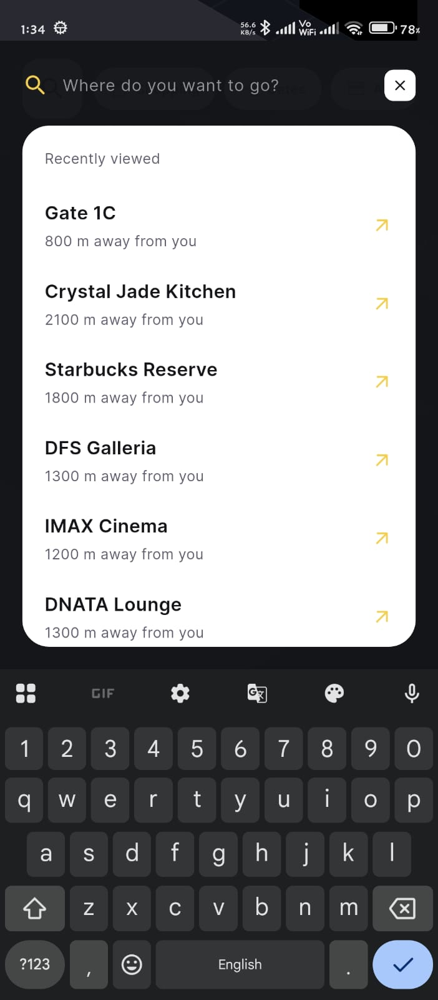
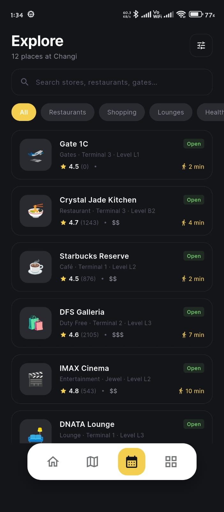
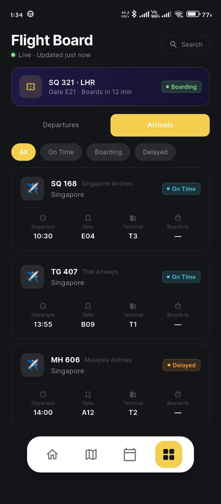
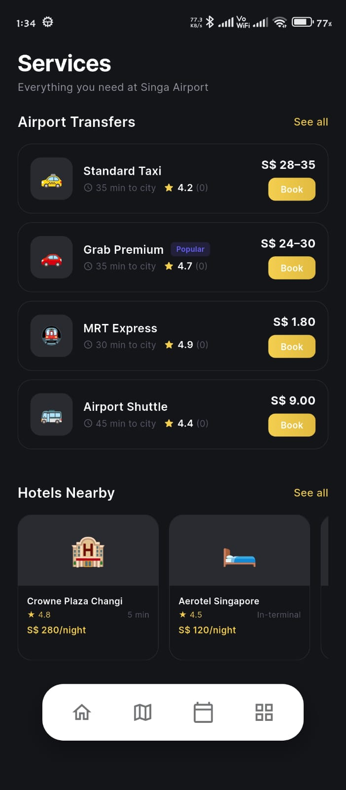
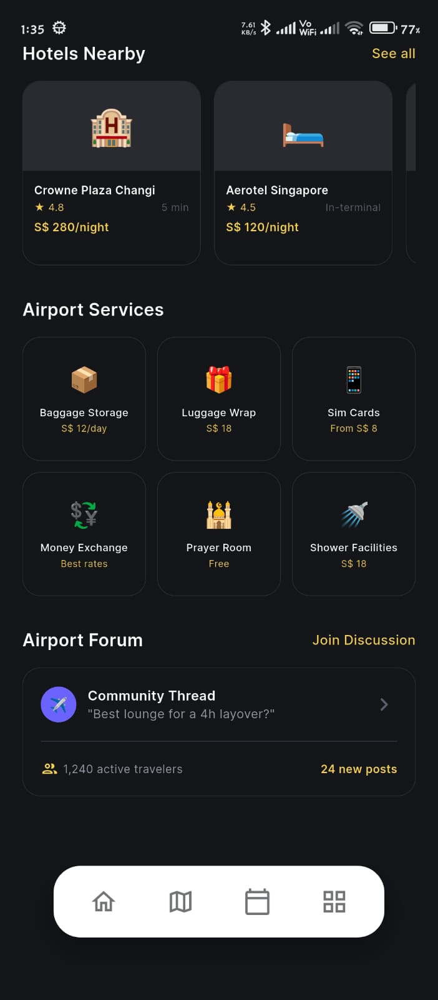
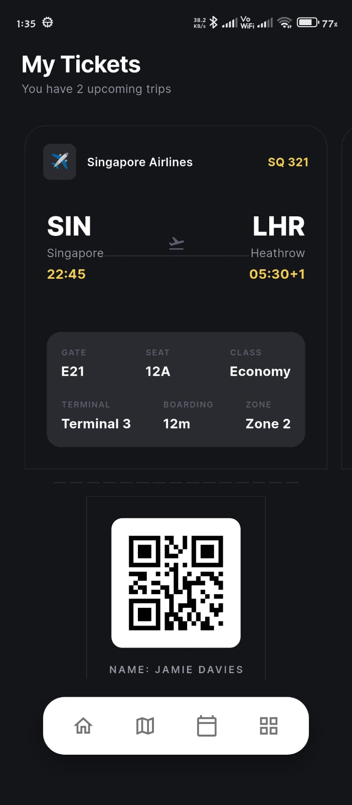

# ✈️ Singa Airport — Premium Terminal Navigation

A high-fidelity, modular Flutter application for airport navigation and flight management. Designed with a sleek dark-mode aesthetic, "Singa Airport" provides an interactive terminal experience with isometric mapping, live-status flight tracking, and integrated travel services.

---

## 📱 Key Screens

| Screen | Features |
|--------|----------|
| **🏠 Home** | Flight overview, smart service grid, and real-time departure status. |
| **🗺️ Map** | Interactive isometric terminal map with custom gates, level selection, and route building. |
| **🔍 Explore** | Category-filtered discovery for lounges, restaurants, and shops. |
| **📋 Flights** | Live departure/arrival boards with search and boarding status filters. |
| **🛠️ Services** | Integrated booking for transfers, hotels, and airport-specific logistics. |
| **🎟️ Tickets** | QR-enabled digital boarding passes with trip-specific flight data. |
| **👤 Profile** | Detailed travel statistics (miles, countries, flights) and user preferences. |
| **🚗 Rent Car** | Dedicated vehicle booking interface with custom haptic-enabled controls. |

---

## 🚀 Technical Highlights

- **Modular Architecture**: UI components are decoupled into specialized domains (e.g., `lib/widgets/map/`), making the codebase highly maintainable.
- **Isometric Map Engine**: Built using pure `CustomPainter` for high-performance rendering without external GIS dependencies.
- **Clean Code Standard**:  verified clean of all analyzer warnings and deprecated APIs.
- **Premium UX**: Pervasive `HapticFeedback`, smooth `flutter_animate` transitions, and custom-designed translucent surfaces (Glassmorphism).

---

---

## 📸 Screenshots

<p align="center">
  
  
  
  
</p>
<p align="center">
  
  
  
  
</p>
<p align="center">
  
  
</p>

---

## 🎬 Demo

## 🎬 Demo

<p align="center">
  <a href="https://github.com/shameer1w2/singa-airport/blob/main/previews/screen_record.mp4">
    
    <br/>
    ▶️ Click to Watch Full Demo
  </a>
</p>

---

---
## 🛠 Tech Stack

- **Flutter 3.x** & **Dart 3.x**
- [**google_fonts**](https://pub.dev/packages/google_fonts) — Inter typography.
- [**flutter_animate**](https://pub.dev/packages/flutter_animate) — Staggered entrance and pulse effects.
- [**qr_flutter**](https://pub.dev/packages/qr_flutter) — High-quality boarding pass QR generation.
- [**percent_indicator**](https://pub.dev/packages/percent_indicator) — Visual progress tracking for miles and boarding.

---

## 📂 Project Structure

```text
lib/
├── main.dart               # Navigation Hub & Screen Caching
├── theme/
│   └── app_theme.dart      # Design tokens & Glassmorphism styles
├── models/
│   └── models.dart         # Type-safe models & sample datasets
├── widgets/
│   ├── shared_widgets.dart # Reusable UI atoms (Buttons, Cards, Chips)
│   └── map/                # Modular Map components (TopBar, BottomSheet, etc.)
└── screens/                # Feature-specific page implementations
```

---

## 🏗 Setup & Installation

1. **Clone the project**
   ```bash
   git clone https://github.com/shameer1w2/singa-airport.git
   ```
2. **Install dependencies**
   ```bash
   flutter pub get
   ```
3. **Run the Application**
   ```bash
   flutter run
   ```

---

## 🧑‍💻 Architecture Notes

- **Map Rendering**: Uses a projection-based `IsometricMapPainter`.
- **Theme**: Strictly follows a "Surface & Elevation" design system using `AppColors`.
- **Navigation**: Optimized using `IndexedStack` to preserve state across terminal maps and flight boards.
- **Verification**: Fully compatible with `flutter analyze --fatal-infos`.
